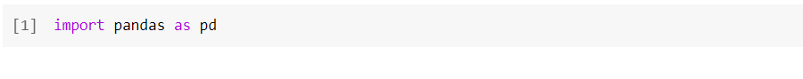
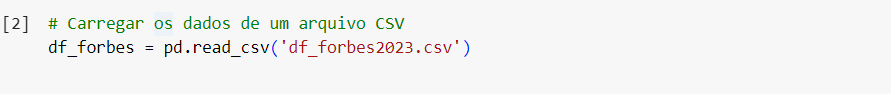
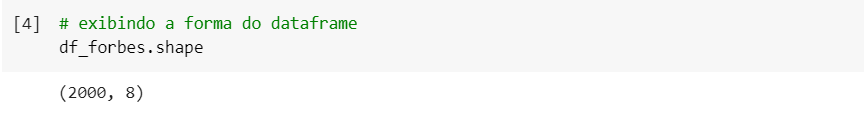
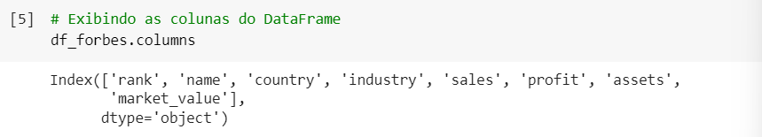
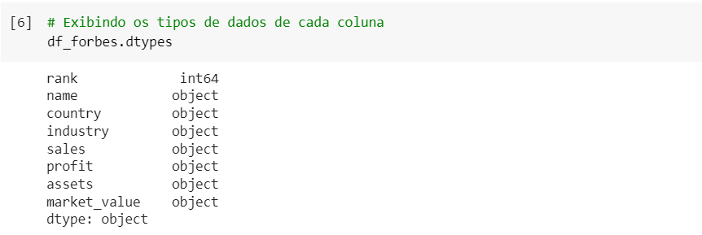
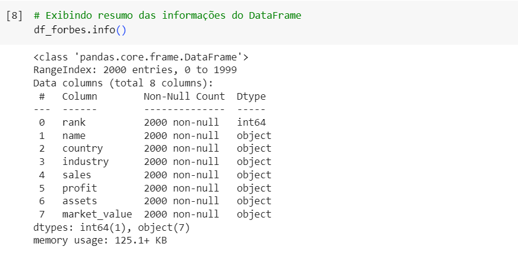
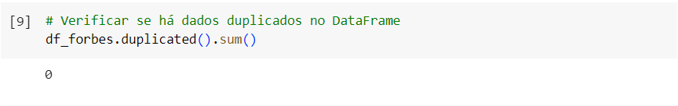
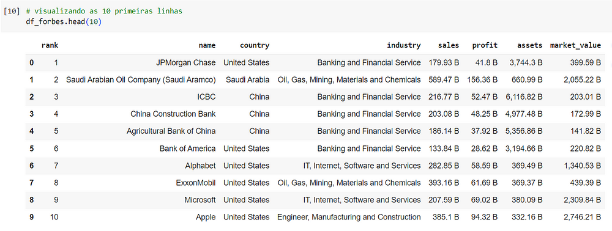
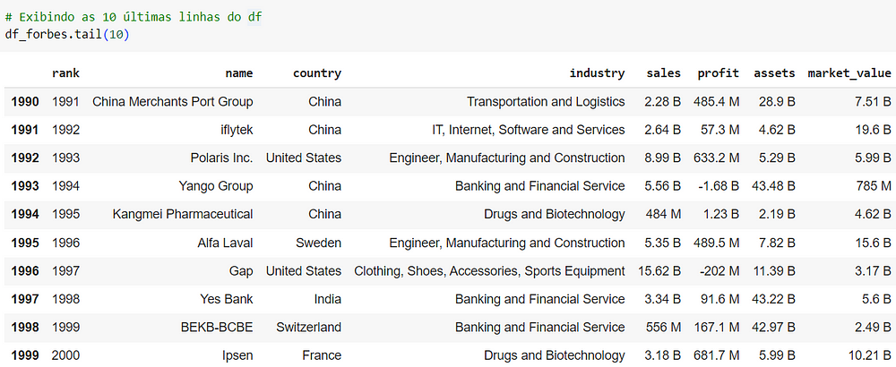

# Análise Exploratória de Dados

  
Quando nos deparamos com um DataFrame, não podemos simplesmente começar a fazer cálculos, obter resultados e realizar análises sem antes verificar a qualidade dos dados. Muitas vezes, nos deparamos com dados duplicados ou ausentes, e é necessário realizar manipulação, limpeza, alteração de tipos de dados, entre outras coisas mais.

Portanto, antes de prosseguir para a análise propriamente dita, é fundamental realizar uma etapa de exploração e preparação dos dados.

## 

**1. Importando Bibliotecas**

Antes de tudo, devemos importar a biblioteca “pandas”:

**2. Carregando os Dados**

Depois utilizaremos o método “pd.read_csv” da biblioteca “pandas”, para importar dados de um arquivo CSV e carregá-los em um DataFrame denominado“df_forbes”:

**3. Conhecendo os Dados**
   
Inicialmente, buscamos compreender o volume de dados, tipos de dados e a presença de valores ausentes ou duplicados.

  **3.1 Tamanho do DataFrame**

Verificamos que o DataFrame possui 2000 linhas e 8 colunas.

  **3.2 Nome das colunas**

- ‘rank’: indica a posição da empresa no ranking.
- ‘name’: nome da empresa.
- ‘country’: país de origem da empresa.
- ‘industry’: setor industrial ao qual a empresa pertence.
- ‘sales’: valor das vendas da empresa.
- ‘profit’: lucro da empresa.
- ‘assets’: ativos totais da empresa.
- ‘market_value’: valor de mercado da empresa.
  
Essas colunas fornecem informações sobre a posição, nome, localização, setor industrial e métricas financeiras das empresas listadas.

  **3.3 Tipo de dado referente a cada coluna**

Com exceção da coluna ‘rank’, que contém valores inteiros (int64), todas as outras colunas são do tipo objeto (object), o que geralmente significa que elas contêm texto ou uma combinação de caracteres. No entanto, nas colunas ‘sales’, ‘profit’, ‘assets’ e ‘market_value’, deveríamos esperar valores numéricos. Mas o fato de estarem sendo tratadas como objetos pode indicar a presença de caracteres não numéricos nessas colunas. Isso pode dificultar análises futuras, podendo ser necessário corrigir esses dados para garantir uma análise mais fácil e precisa.

  **3.4 Verificando a ausência de valores**

Todas as colunas retornaram 0, o que indica que não há valores ausentes nos dados.

> O método info() fornece um resumo abrangente das informações do DataFrame, incluindo o número de entradas não nulas em cada coluna, o tipo de dados de cada coluna e um resumo geral do DataFrame. Ele pode substituir a necessidade de usar os atributos shape, columns e dtypes individualmente, além do método isnull(). Agrupar essas informações em um único bloco permite uma visão rápida e completa das características do DataFrame.

  **3.5 Total de valores duplicados**

Constatamos que não há valores duplicados em nosso conjunto de dados. Isso é importante porque indica que cada entrada é única e não há necessidade de lidar com duplicatas durante a análise.

**4. Visualização**
   
Dado o grande volume de dados, não é viável visualizá-los por completo. Nesse cenário, é comum delimitar uma amostra para obter uma visão geral das informações.

  **4.1 Primeiras linhas**

  **4.2 Últimas linhas**

Pode-se observar nas colunas ‘sales’, ‘profit’, ‘assets’ e ‘market_value’ que alguns valores estão acompanhados das letras ‘B’ e ‘M’. Essa variação nas unidades sugere que os valores estão em diferentes escalas, representando bilhões e milhões, respectivamente. Para garantir consistência e facilitar a análise, é essencial remover esses indicadores de unidade e converter todos os valores das colunas para a mesma escala.

Além disso, é importante notar que alguns valores são expressos em milhares de bilhões, o que pode dificultar a manipulação dos dados. Por exemplo, na primeira empresa listada, temos que ‘assets’ foi de ‘3,744.3 B’, onde a presença da vírgula atrapalha a interpretação correta. Portanto, será necessário remover as vírgulas para garantir a consistência nos dados.

##

Concluindo, essa foi a etapa inicial da análise e, como podemos ver, conseguimos obter informações bastante relevantes para a manipulação dos dados. A próxima etapa será o tratamento dos dados, para estarem corretos e possamos extrair o conhecimento adequado do DataFrame. Espero que tenham gostado e até a próxima análise!

##

[Transformação dos Dados](tratamento.md)

[Análise Estatística](estatistica.md)

[Outliers](outliers.md)
