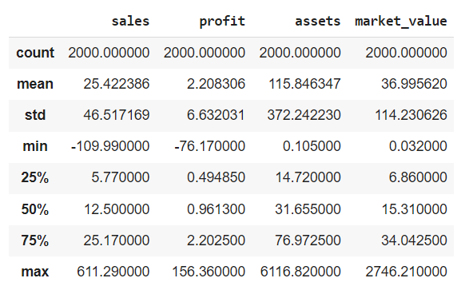
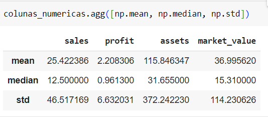
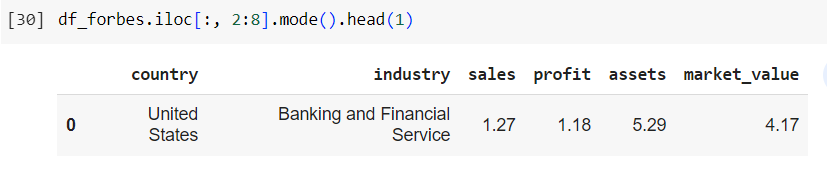
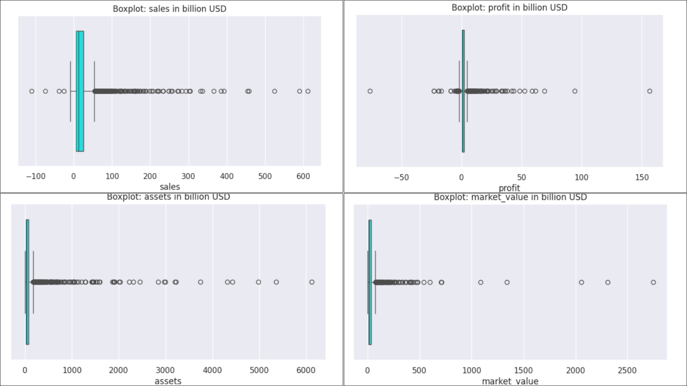
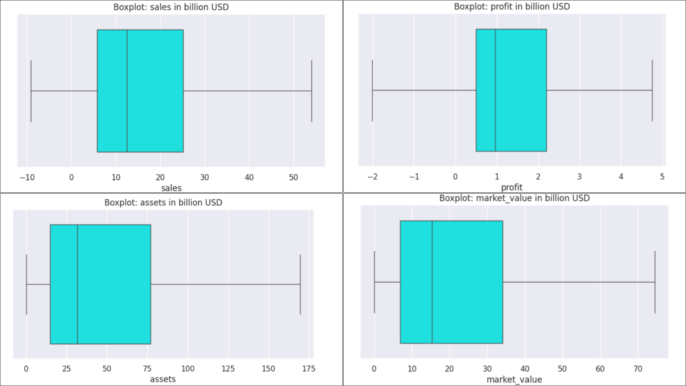

# Análise Estatística Descritiva

<div align="justify">

Nesta etapa do projeto, apliquei algumas técnicas estatísticas para descrever e sintetizar esse conjunto de valores, a fim de obter uma visão global da variação desses dados.

##
Recapitulando, neste conjunto de dados temos 8 colunas:

> - ‘rank’
> - ‘name’ (nome)
> - ‘country’ (país)
> - ‘industry’ (indústria/setor)
> - ‘sales’ (vendas)
> - ‘profit’ (lucros)
> - ‘assets’ (ativos)
> - ‘market_value’ (valor de mercado)

## 1. Medidas Estatística Descritivas

Para grande parte da nossa análise, as colunas mais relevantes são aquelas relacionadas aos valores das empresas, ou seja, ‘sales’, ‘profit’, ‘assets’ e ‘market_value’. Portanto, vamos separá-las em uma variável chamada ‘colunas_numericas’.

```
colunas_numericas = df_forbes[['sales', 'profit', 'assets', 'market_value']]
```

### 1.1. describe()

Agora, vamos visualizar as medidas estatísticas básicas:

```
# calcula estatísticas descritivas das variáveis numéricas
colunas_numericas.describe()
```
</div><div aling="center">
    


</div><div aling="justify">

Devido à presença de valores negativos, procurei verificar se eram frutos de algum erro na etapa de ETL. No entanto, constatei que os valores estão de acordo com a lista original disponibilizada no site da Forbes. Portanto, existem algumas empresas em que os valores das métricas são realmente negativos.

Observamos também uma grande amplitude na variação desses valores, indicando uma grande disparidade entre as empresas. Algumas têm valores em bilhões, outras em milhões e algumas estão negativadas. Além disso, notamos uma diferença significativa entre a média e a mediana, o que sugere a presença de alguns valores extremamente altos que puxam a média para cima, indicando uma possível assimetria positiva. O desvio padrão também revela um grau de dispersão dentro do conjunto de dados. Quanto maior a distância de zero, menos uniformes são os dados.

</div><div aling="center">
    


</div><div aling="justify">
    
### 1.2. mode()

Para identificar os valores mais frequentes neste DataFrame, a moda pode ser aplicada não apenas às colunas numéricas, mas também às colunas categóricas, como aquelas referentes aos países e setores.

</div><div aling="center">
    


</div><div aling="justify">
    
É válido ressaltar que, em uma lista com a classificação de empresas, é altamente improvável que duas ou mais empresas tenham exatamente o mesmo valor para métricas como ativos, vendas ou lucros. Isso se deve à natureza única e específica de cada empresa, com suas próprias operações, estruturas e desempenho financeiro. Portanto, se por acaso ocorrer a repetição de valores nessas métricas, é mais provável ser uma coincidência decorrente da diversidade e complexidade das empresas listadas, em vez de indicar uma tendência significativa ou padrão.

## 2. Visualização Gráfica

Para compreender melhor o significado dessas medidas estatísticas, especialmente diante da grande variação de valores, é sempre vantajoso recorrer a uma representação visual.

O Boxplot, ou diagrama de caixa, é uma ferramenta útil para visualizar e compreender a distribuição e a dispersão dos dados, destacando características como a mediana, quartis, outliers e a amplitude dos valores.

```
plt.rcParams['figure.figsize'] = [8, 4]
sns.set_theme()

### para cada uma das colunas numericas roda o boxplot
for column in colunas_numericas:
    plt.figure()
    sns.boxplot(data = df_forbes , x = column, color='cyan',showfliers=True) # indica que os valores discrepantes (outliers) devem ser exibidos no gráfico.
    plt.title("Boxplot: "+column + " in billion USD")
```
</div><div aling="center">
    


</div><div aling="justify">
    
Nos gráficos de caixa, observamos uma considerável quantidade de outliers representados pelos pontos fora dos limites da caixa. Isso sugere uma grande dispersão nos valores de algumas empresas, resultando em uma desuniformidade na classificação, e a análise do gráfico é inviabilizada.

### 2. 1 Removendo Outliers

Para simplificar a análise, podemos gerar os boxplots sem considerar esses outliers, utilizando o parâmetro ‘showfliers = False’ na função correspondente.

```
plt.rcParams['figure.figsize'] = [8, 4]
sns.set_theme()

### para cada uma das colunas numericas roda o boxplot
for column in colunas_numericas:
    plt.figure()
    sns.boxplot(data = df_forbes , x = column, color='cyan',showfliers=False) # indica que os valores discrepantes (outliers) devem ser exibidos no gráfico.
    plt.title("Boxplot: "+column + " in billion USD")
```
</div><div aling="center">
    


</div><div aling="justify">
    
Perceberam a diferença?

Agora, ao suprimir a plotagem de outliers (showfliers=False), conseguimos visualizar melhor a distribuição dos valores no boxplot. Podemos observar os valores mínimos e máximos através do comprimento da cauda, e verificar se os dados estão mais concentrados entre o primeiro quartil e a mediana, ou entre a mediana e o terceiro quartil. Se a caixa (que representa o intervalo interquartil) é mais longa, os dados estão mais dispersos, enquanto se é mais curta, os dados estão mais concentrados em torno da mediana.

## 3. Considerações
Após a análise estatística, destacamos algumas conclusões significativas. Foi observada uma ampla variação nos valores das métricas das empresas, refletindo uma grande disparidade entre elas.

Os boxplots proporcionaram uma visualização mais clara da distribuição dos valores, permitindo identificar outliers e a concentração dos dados em diferentes faixas. A supressão dos outliers nos possibilitou uma visão mais precisa da distribuição, observando os quartis e a mediana.

É importante considerar o impacto dos outliers em nossas análises futuras. Eles podem influenciar significativamente nossos resultados, sendo necessário avaliar se devem ser considerados ou descartados em nossas análises subsequentes.

Essas questões são essenciais para avançar com a análise e garantir a precisão de nossos resultados.

##

Parte I: [Análise Exploratória](analise_exploratoria.md)

Parte II: [Tratamento dos Dados](tratamento.md)

Parte III: [Análise Estatística](estatistica.md)

Parte IV: [Outliers](outliers.md)

</div>
