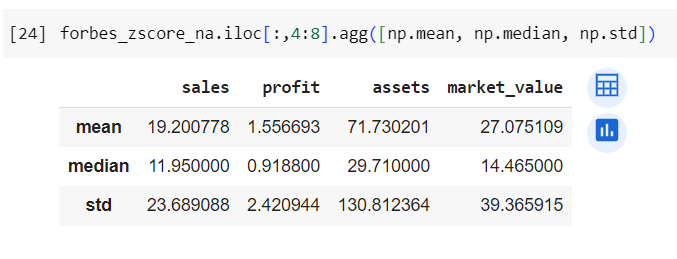
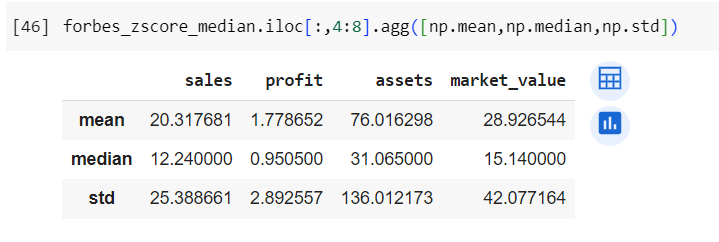
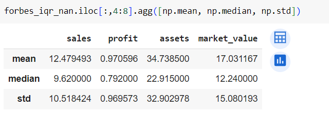
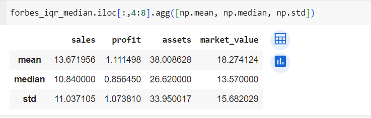

# Manipulando os Outliers

<div align="justify">

Após a detecção dos outliers, surge a necessidade de decidir como manipulá-los antes de prosseguir com as análises. Dentre as alternativas, podemos optar por:
- Manter os outliers.
- Substituí-los por valores nulos e, em seguida:
  - Removê-los do conjunto de dados
  - Ou substituí-los pela mediana.

## Metódo Z-score
### Substituição dos Outliers por valores nulos

O primeiro passo é criar uma função que substituirá os valores outliers por NaN (valores nulos). Esta função recebe o conjunto de dados (dataset), um limite para identificação de outliers (threshold) e o nome da coluna (colname). Para cada valor na coluna, calcula o escore Z, identifica os outliers com base no limite especificado e os substitui por NaN.

```
# substitui outliers por NaN
def replace_na_outlier_zscore(dataset, threshold, colname):
  ### funcao que faz um replace para NaN (valor nulo) caso seja encontrado um outlier
    df = dataset[colname]
    outliers = []
    zscore = []
    val = []
    threshold = threshold
    mean = np.mean(df)
    std = np.std(df)
    for i in df.values:
      z_score= (i - mean)/std
      zscore.append(z_score)
      if np.abs(z_score) > threshold:
          outliers.append(i)
          val.append(np.nan)
      else:
          val.append(i)

    return val
```
#### 1. Removendo os nulos

Esta função remove as linhas que contêm valores nulos. Itera sobre cada coluna numérica do conjunto de dados (dataset), usando a função `replace_na_outlier_zscore` para substituir os outliers por NaN e, em seguida, utiliza o método dropna() para remover as linhas com valores nulos.

```
def drop_outliers(dataset, threshold):
  ### vamos utilizar a funcao drop NA para remover outliers
  for column in colunas:
    dataset[column] =  replace_na_outlier_zscore(dataset, 3, column)
  return dataset.dropna()
```
Aplica-se a remoção de outliers usando o método Z-score com substituição por NaN ao DataFrame df_forbes e atribui o resultado ao DataFrame forbes_zscore_na.

``` 
forbes_zscore_na = drop_outliers(df_forbes, 3)
```

Após as alterações, podemos calcular a média, mediana e o desvio padrão do dataset resultante para observar se os dados estão menos dispersos, ou seja, mais uniformes.



#### 2. Substituindo pela mediana

Esta função substitui os outliers pela mediana da respectiva coluna. Funciona de maneira semelhante à função drop_outliers, mas, em vez de remover as linhas, substitui os valores nulos pela mediana da coluna correspondente usando o método fillna().

```
def replace_median_outliers(dataset, threshold):
  ### vamos utilizar a funcao fillna para trocar os NaNs pela mediana
  for column in dataset.select_dtypes(include=np.number).columns:
    dataset[column] =  replace_na_outlier_zscore(dataset, 3, column)
  return dataset.fillna(dataset.median())
```

Aplica-se a remoção de outliers usando o método Z-score com substituição pela mediana ao DataFrame df_forbes e atribui o resultado ao DataFrame forbes_zscore_median.

```
forbes_zscore_median = replace_median_outliers(df_forbes, 3)
```


## Metódo IQR

Utilizando o método IQR, seguiremos um processo muito semelhante ao apresentado anteriormente. Foram criadas três funções: uma para substituir outliers por valores nulos, outra para eliminar os valores nulos no dataset e uma terceira para substituir os outliers pela mediana. A análise dos resultados incluirá a média, mediana e desvio padrão, ilustrando como essas manipulações afetam nossos resultados.

### Substituição dos Outliers por valores nulos
```
def replace_outliers_na_iqr(dataset, colname, threshold):
    df = dataset[colname]
    threshold = threshold
    q25, q75 = df.quantile(0.25), df.quantile(0.75)
    IQR = q75 - q25
    cut_off = threshold * IQR
    lower, upper = q25 - cut_off, q75 + cut_off
    
    for i in range(len(df)):
        if df.iloc[i] > upper or df.iloc[i] < lower:
            dataset.at[i, colname] = np.nan
```
#### 1. Removendo os nulos
```
def replace_outliers_and_drop_na(dataset, threshold):
    for column in dataset.select_dtypes(include=np.number).columns:
        replace_outliers_na_iqr(dataset, column, threshold)
    return dataset.dropna()
```


#### 2. Substituindo pela mediana
```
def replace_outliers_median_iqr(dataset, threshold):
  for column in dataset.select_dtypes(include=np.number).columns:
    replace_outliers_na_iqr(dataset, column, threshold)
  return dataset.fillna(dataset.median())
```


## 3. Considerações
Ao usar o método dropna, os outliers são removidos do conjunto de dados, o que reduz a variabilidade dos dados. Isso acontece porque os outliers tendem a aumentar a média e o desvio padrão, e ao removê-los, essas medidas tendem a diminuir. Portanto, as médias e medianas podem ser menores após a remoção dos outliers, e os desvios padrão também podem diminuir devido à redução da dispersão dos dados.

Por outro lado, ao usar o método fillna para substituir outliers pela mediana, os valores extremos são substituídos por valores mais próximos do centro da distribuição, mas ainda mantendo a variabilidade dos dados. Nesse caso, a distribuição dos dados pode permanecer mais próxima da original, resultando em uma dispersão geralmente maior em comparação com a remoção de outliers. Assim, as medidas estatísticas como médias e medianas podem ser maiores e os desvios padrão podem aumentar, refletindo a presença de valores extremos substituídos pela mediana.

## 4. Conclusão

Ao comparar a remoção de outliers utilizando os métodos IQR e Z-score, observamos que as médias e medianas das métricas ao remover os outliers são ligeiramente menores em comparação com a substituição pela mediana. Além disso, os desvios padrão também são menores, indicando uma menor dispersão dos dados após o tratamento dos outliers.

Vale resaltar que os valores obtidos pelo método IQR são menores que os obtidos pelo Z-score. Essa disferença nos resultados pode ser atribuída à forma como esses métodos lidam com a distribuição dos dados, sendo o IQR mais conservador em suas abordagens, como apontado no post anterior.

Ao optar por um conjunto de dados com uma dispersão menor, as estatísticas descritivas tendem a ser mais concentradas em torno dos valores médios, o que pode dar uma impressão de maior consistência nos dados. Isso sugere que um conjunto de dados com uma dispersão menor pode levar a estimativas mais estáveis e confiáveis.

No entanto, ao remover outliers do conjunto de dados, estamos filtrando essas observações extremas que podem representar situações incomuns ou excepcionais. Se futuros outliers surgirem durante a coleta de dados ou no ambiente de negócios, um conjunto de dados com uma dispersão menor pode ser menos sensível a essas variações extremas. Por outro lado, um conjunto de dados com uma dispersão maior pode refletir mais fielmente a amplitude potencial de valores observados e destacar a heterogeneidade e a complexidade dos fenômenos em estudo.

Em resumo, a escolha entre utilizar um conjunto de dados com uma dispersão maior ou menor depende do contexto específico do problema, das metas da análise e das preferências do analista. Deve-se ponderar cuidadosamente os prós e contras de cada abordagem e avaliar como ela pode afetar a interpretação dos resultados e a validade das conclusões tiradas a partir dos dados.

##

Parte I: [Análise Exploratória](analise_exploratoria.md)

Parte II: [Tratamento dos Dados](tratamento.md)

Parte III: [Análise Estatística](estatistica.md)

Parte IV: [Outliers](outliers.md)

**Parte V: Manipulando Outliers**

Parte VI: [Análise Estatística e de Distribuição](manipulacao_outliers.md)

</div>
