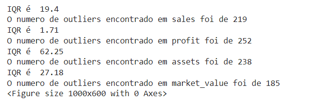
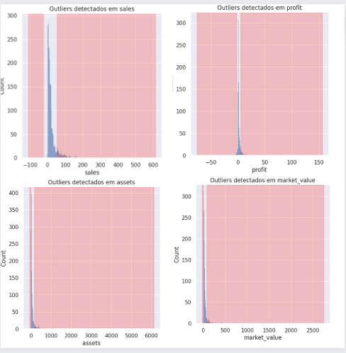
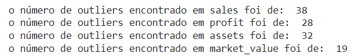
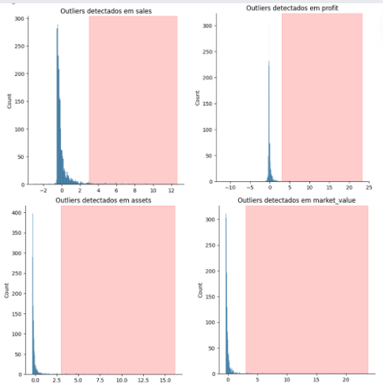

# Outliers

<div align="justify">

Na análise estatística descritiva, podemos observar que alguns valores se distanciam significativamente da mediana, sugerindo a possibilidade de serem outliers. 

No entanto, existem outras abordagens que podem ser úteis para identificar esses pontos discrepantes, como o método IQR e o método Z-score. Nesta seção, exploraremos essas duas metodologias.

## Método IQR

O Intervalo Interquartil (IQR) é uma medida estatística que revela a dispersão dos dados em torno da mediana.

Neste método, consideramos como outiers valores que estão:
- acima de `Q3 + 1.5 * IQR`
- abaixo de `Q1 - 1.5 * IQR`


Para realizar este cálculo, utilizamos uma função que recebe um conjunto de dados (dataset) e o nome de uma coluna (colname). A função calcula os quartis 25 e 75, o intervalo interquartílico (IQR) e os limites inferior e superior para identificar outliers.

Em seguida, itera sobre os valores da coluna para encontrar os outliers e os armazena em uma lista. Então, imprime-se o número de outliers encontrados e retorna os limites inferior e superior, além da lista de outliers.

```
  def find_outlier_iqr(dataset, colname):

    # calcula os quartis Q1 (25º percentil) e Q3 (75º percentil) da coluna.
    q25, q75 = np.quantile(dataset[colname], 0.25), np.quantile(dataset[colname], 0.75)

    # calcula  IQR
    iqr = q75 - q25

    # calcula outlier cutoff
    cut_off = iqr * 1.5

    # calcula margens inferiores, lower e superiores upper
    lower, upper = q25 - cut_off, q75 + cut_off
    print(' IQR é ',iqr)

    #print('Valor minimo', lower)
    #print('Valor maximo', upper)

    outliers = []

    #loop itera sobre os valores da coluna, e os valores que são considerados outliers são adicionados à lista outliers

    for i in dataset[colname].values:
      if((i > upper)or(i < lower)):
        outliers.append(i)

    # a função imprime o valor de IQR e o número de outliers encontrados, e retorna as margens inferior e superior e a lista de outliers

    print('O numero de outliers encontrado foi de', len(outliers))
    return lower, upper, outliers
```

Para aplicar a função `find_outlier_iqr` em todas as colunas desejadas, primeiro isolamos as colunas de interesse do nosso dataframe: 

```
colunas = df_fobes.iloc[:, 4:8]
```

Desta forma, selecionamos somente as coluans `'sales'`, `'profit'`, `'assets'` e `'market_value'`.

Quando chamada, se identificados outliers na coluna , um gráfico de distribuição é plotado usando `sns.displot()` com uma marcação visual para destacar a presença de outliers nas margens inferior e superior.

```
for column in colunas:
  lower, upper, out =  find_outlier_iqr(df_forbes, column)
  if (len(out) > 0):
    plt.figure(figsize = (10,6))
    sns.displot(df_forbes[column], kde=False)
    plt.axvspan(xmin = lower,xmax= df_forbes[column].min(),alpha=0.2, color='red')
    plt.axvspan(xmin = upper,xmax= df_forbes[column].max(),alpha=0.2, color='red')
    plt.title("Outliers detectados em {}".format(column))
```

</div>

<div align="center">
  




</div>

<div align="justify">

## Metódo Z-score

Neste modelo, a referência para identificar um outlier é quantos desvios padrão o valor está da média. Se o `Z-score` for maior que 3 vezes o desvio padrão, geralmente pode-se considerar um outlier.

Aqui também utilizaremos uma função para determinar o número de outliers:

```
### funcao que calcula a quantidade de outliers encontrados dado o nome do dataframe, o     threshold e o nome da coluna
def find_outlier_zscore(dataset, threshold, colname):

    # seleciona a coluna específica do conjunto de dados com base no nome fornecido em colname e a atribui à variável df
    df = dataset[colname]

    # inicializa duas listas vazias, uma para armazenar os valores dos outliers (outliers) e outra para armazenar os escores Z calculados para cada valor da coluna (zscore).
    outliers = []
    zscore = []

    # atribui o valor de limite do escore Z fornecido em threshold à variável threshold.
    threshold = threshold

    # calcula a média (mean) e o desvio padrão (std) dos valores na coluna especificada.
    mean = np.mean(df)
    std = np.std(df)

    # itera sobre cada valor na coluna df.
    for i in df.values:

    # calcula o escore Z para cada valor da coluna usando a fórmula do escore Z: (valor - média) / desvio padrão; e Adiciona o escore Z calculado à lista de escores Z.
      z_score= (i - mean)/std
      zscore.append(z_score)

      #Verifica se o valor absoluto do escore Z é maior que o limite definido em threshold e adiciona a lista
      if np.abs(z_score) > threshold:
          outliers.append(i)

    print("o número de outliers encontrado em {} foi de: ".format(colname),len(outliers))
    return zscore, outliers
```

Chama-se a função `find_outlier_zscore` para calcular os escores e identificar os outliers na coluna atual

```
for column in colunas:
  zscore, out =  find_outlier_zscore(df_forbes, 3, column)
  if len(out) > 0:
    plt.figure(figsize = (10,5))
    sns.displot(zscore)
    plt.axvspan(xmin = 3 ,xmax= max(zscore),alpha=0.2, color='red')
    plt.title("Outliers detectados em {}".format(column))
```
</div>

<div align="center">
  




</div>

## Considerações

<div align="justify">

Após analisar os resultados obtidos com os dois métodos de detecção de outliers, podemos concluir que há uma diferença significativa na quantidade de outliers identificados. O método z-score tende a identificar menos outliers em comparação com o método IQR.

O método z-score identifica outliers com base na distância de um ponto em relação à média e ao desvio padrão dos dados. Ele é mais sensível a desvios extremos em relação à média, o que pode resultar em uma detecção mais conservadora de outliers.

Por outro lado, o método IQR utiliza os quartis dos dados para identificar valores extremos. Ele é menos sensível a variações nos extremos dos dados, priorizando a identificação de valores atípicos com base na distribuição interquartil dos dados.

A escolha entre os dois métodos depende das características específicas dos dados e dos objetivos da análise. O método z-score pode ser mais adequado quando se deseja identificar desvios extremos em relação à média, enquanto o método IQR pode ser preferível para detectar valores atípicos com base na distribuição interquartil dos dados.

Para prosseguir com o projeto, é recomendável considerar os resultados obtidos com ambos os métodos e avaliar qual abordagem melhor se alinha aos objetivos da análise. Além disso, é importante realizar uma investigação mais aprofundada das razões por trás das diferenças na detecção de outliers, o que pode fornecer insights adicionais sobre a natureza dos dados e a adequação dos métodos de detecção de outliers.

</div>

##

[Análise Exploratória](analise_exploratoria.md)

[Transformação dos Dados](tratamento.md)

[Análise Estatística](estatistica.md)
