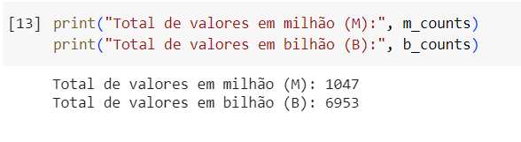
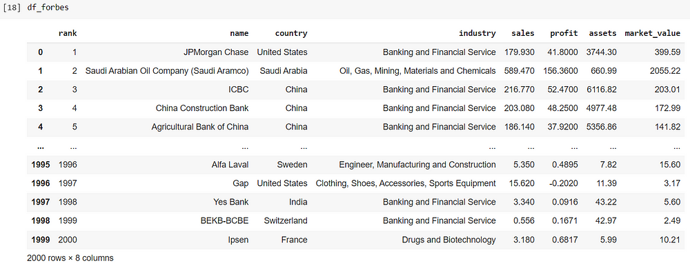
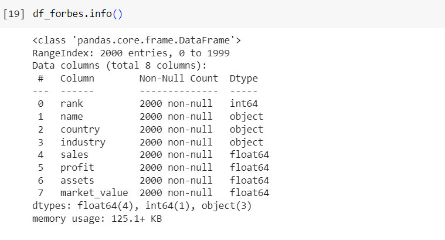

# Tratamento de Dados em Python

## 1. Apresentando o problema

Como apresentado neste artigo aqui, identifiquei uma questão relevante que pode afetar nossa análise: a inconsistência nos formatos dos valores das colunas “sales”, “profit”, “assets” e “market_value”.

Essas colunas apresentam valores em diferentes escalas, alguns expressos em bilhões e outros em milhões. Essa disparidade pode distorcer nossas análises e assim, comprometer a interpretação dos resultados.

Além disso, a presença de vírgulas em alguns valores expressos em milhares de bilhões inviabilizam a tipagem dos dados como numéricos, o que requer uma intervenção para garantir a consistência e a qualidade dos dados.

Portanto, devemos considerar as seguintes correções:

**1.1** Padronização da Escala: Devemos selecionar uma escala padrão para todas as colunas afetadas, seja bilhões ou milhões.

**1.2** Remoção de Caracteres Especiais: É necessário remover os caracteres “B” e “M” dos valores, que indicam bilhões e milhões, respectivamente.

**1.3** Conversão para a Escala Selecionada: Os valores devem ser convertidos para a escala padrão escolhida, garantindo uniformidade e consistência nos dados.

**1.4** Padronização dos Dados de Milhares de Bilhões: alguns valores estão expressos em milhares de bilhões e apresentam vírgulas, o que pode interferir na consistência dos dados. Portanto, será necessário remover as vírgulas desses valores para garantir a uniformidade e a precisão nas análises.

**1.5** Transformação para Tipo Numérico: Por fim, as colunas manipuladas devem apresentar o tipo como numérico, facilitando análises quantitativas e cálculos estatísticos.
Enfim, depois de muito falatório, mãos na massa!

## 2. Entendendo os valores

Primeiro vamos verificar se temos mais valores em milhões ou em bilhões

```
m_counts = df_forbes[['sales', 'profit', 'assets', 'market_value']].apply(lambda x: x.str.contains('M', regex=True)).sum().sum()
b_counts = df_forbes[['sales', 'profit', 'assets', 'market_value']].apply(lambda x: x.str.contains('B', regex=True)).sum().sum()
````

O método ‘apply()’ é utilizado para verificar se cada valor na coluna contém a letra ‘M’ através da função ‘contains’, retornando uma matriz booleana. A primeira chamada de ‘sum()’ é empregada para somar o número de valores ‘True’ em cada coluna, ou seja, quantifica quantos valores em cada coluna contêm ‘M’. Como estamos operando em um DataFrame, a soma é realizada ao longo das linhas. Em seguida, a segunda chamada de ‘sum()’ é empregada para somar os resultados das somas anteriores. Isso nos fornece o total de valores em todas as colunas selecionadas que contêm ‘M’.

O mesmo procedimento é repetido para ‘B’. Inicialmente, verificamos quantos valores em cada coluna contêm ‘B’ e, em seguida, somamos esses resultados para obter o total de valores em todas as colunas que contêm ‘B’.



O resultado revela que a maioria dos valores no DataFrame está na escala de bilhões de dólares. Com o intuito de simplificar nossa análise e evitar lidar com números muito grandes, decidimos padronizar todos os valores para bilhões de dólares como unidade de medida.

## 3. Conversão
   
Vamos criar uma função que encapsula todos os passos necessários para a conversão do valor.

```
def convert_value(value):
   
    # Remover a vírgula dos valores de milhares de bilhões
    value = value.replace(',', '')

    # Se, escala de milhões, o valor retornado será convertido para bilhões
    if 'M' in value:
        return float(value.replace('M', '')) * 0.001

    # Caso contrário, retorna o próprio valor
    else:
        return float(value.replace('B', ''))
```

A função ‘convert_value’ recebe um valor como entrada. Primeiro, ela remove qualquer vírgula presente no valor. Em seguida, verifica se o valor está na escala de milhões. Se sim, o valor é convertido para bilhões, multiplicando-o por ‘0.001’ após remover o caractere ‘M’. Caso contrário, remove-se o caractere ‘B’ e converte-se o valor para ‘float’.

Para aplicar a função de conversão às colunas que necessitam de transformação, primeiro listamos essas colunas em uma lista chamada ‘cols_to_convert’. Em seguida, utilizamos um loop para percorrer cada uma dessas colunas no DataFrame.

```
# Lista das colunas a serem convertidas
cols_to_convert = ['sales', 'profit', 'assets', 'market_value']

# Loop sobre as colunas especificadas do DataFrame
for col in cols_to_convert:
    df_forbes[col] = df_forbes[col].apply(convert_value)
```

Durante cada iteração do loop, a função ‘convert_value’ é aplicada a cada valor presente na coluna em questão, convertendo os valores conforme as regras estabelecidas na função.

Após aplicarmos a função de conversão, podemos visualizar o DataFrame e verificar que os valores foram adequadamente convertidos.



Em seguida, ao utilizarmos o método ‘info()’, confirmamos a alteração da tipagem dos dados nas colunas em questão, garantindo que estejam consistentes e prontos para análises posteriores.




## Considerações

Após o processo de tratamento de dados realizado, podemos concluir que agora nosso conjunto de dados está mais limpo, consistente e pronto para análise. Ao removermos as inconsistências nos formatos dos valores, padronizar as escalas e converter as colunas para o tipo numérico, garantimos que nossos dados estejam em um formato adequado para análises quantitativas e cálculos estatísticos. Essas etapas são essenciais para garantir a confiabilidade e a precisão de nossas análises futuras.

O processo de tratamento de dados é fundamental em qualquer projeto de análise de dados, e os passos realizados aqui demonstram o cuidado e a atenção necessários para garantir a qualidade e a integridade dos nossos dados.

##

Parte I: [Análise Exploratória](analise_exploratoria.md)

Parte II: [Tratamento dos Dados](tratamento.md)

Parte III: [Análise Estatística](estatistica.md)

Parte IV: [Outliers](outliers.md)
